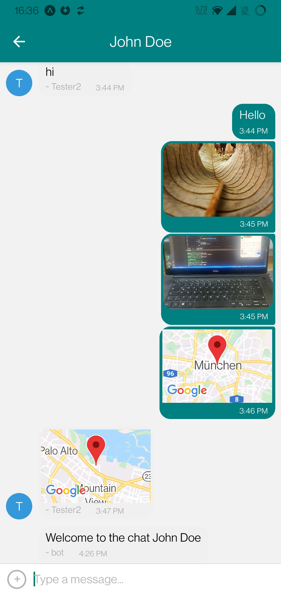

# Chat App

A chat app for mobile devices created in React Native: a chat interface as well as options to share images and the users location.

## Screenshots

   
## Key Features
* On the Start screen the user can enter their name and choose a background color for the their message bubbles before joining the chat. 
* On the Chat screen the user can see past messages, create and send new ones as well as share pictures from their gallery, take fotos or share their location.
* Data gets stored online and offline, so message history is available while offline. (New messages can of course not be sent while offline.)
* Full accessibility (for screen readers etc.). 

## User Stories 
* As a new user, I want to be able to easily enter a chat room so I can quickly start talking to my friends and family.
* As a user, I want to be able to send messages to my friends and family members to exchange the latest news.
* As a user, I want to send images to my friends to show them what I’m currently doing. ● As a user, I want to share my location with my friends to show them where I am.
* As a user, I want to be able to read my messages offline so I can reread conversations at any time. 
* As a user with a visual impairment, I want to use a chat app that is compatible with a screen reader so that I can engage with a chat interface. 

## Built With
- Major languages: Javascript
- Frameworks: React Native
- Android Studio (for emulating the app on various devices)
- Dependencies:
    * React Native
    * Expo (inkl Expo Go for Android)
    * Google Cloud Firestore Database
    * Google Firebase authentication
    * Gifted Chat library
    * React-navigation library (to enable gesture navigation between screens)
    * @expo/react-native-action-sheet (to display a menu for sharing fotos or location)
    * expo-image-picker (for sharing pictures from the device gallery)
    * expo-av (to record and play audio)
    * expo-location (to share the users location)
    * react-native-maps (to display a map when sharing location)
    * expo-permissions (to require users permission to access gallery, camera or location)
    * async-storage (to display message history while offline)
    * NetInfo (to find out if the user is online or not)

## Usage
Install dependencies: `npm install`

Start Metro Server (=expo testing environment): `expo start` 
From there you can run the app on your physical smartphone in the app Expo Go (which you need to install from the app store) or in a emulation created by Android Studio or iOS Simulator.
On Android: Shake device to open developer tools.
To stop the Metro Server (on Windows): Ctrl + C

The database used to store messages and media files online is (Google Firestore)[https://console.firebase.google.com/]
You will need to set up your own database to use the repo. You need a collection called "messages" in which each message will be stored as separate document.
The credentials to access the database need to be stored in the constructor of Chat.js, in a variable called `firebaseConfig`.

Anonymous authentication is also implemented through Google Firebase. 

## Hint
Additional comments and code fragments can be found in the latest development branch [networkStatus](https://github.com/MitoMonkey/Chat-App/tree/networkStatus)

## Things that could be improved
* When user is offline, don't just hide the inputToolbar, but disable it and render ist text to be "you are currently offline" (or show a system message).
* Allow users to create new draft messages while offline
* Safe the color chosen in Start.js into each message, so that (also old) messages are always displayed with the correct color.
* When openening the app while offline, skip the Start screen as a username and color are not important when not able to send messages anyway. (But make sure to display it as soon as network connection is established)
* Make use of `user.avatars` in GiftedChat
* While a foto is being uploaded display a "loader"
* Functionality to record and send audio files (record function is already implemented, just not integrated)
* Functionality to play audio files in messages (`renderBubble` should be good to add the “play audio” functionality to the message bubbles)

## Author
👤 **Mito.this**
- GitHub: [@MitoMonkey](https://github.com/MitoMonkey/)
- LinkedIn: [LinkedIn](https://www.linkedin.com/in/michael-flohrsch%C3%BCtz-8a58321b3/)

Created during the Fullstack Webdevelopment course @CareerFoundry

Contributions, issues, and feature requests are welcome!

Feel free to check the [issues page](../../issues/).
